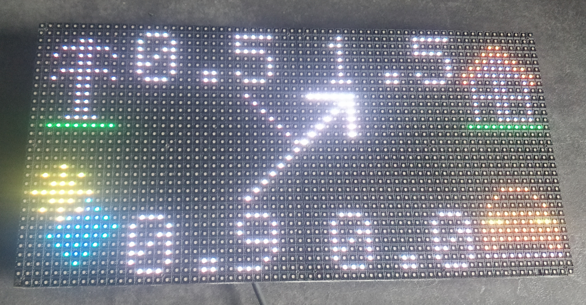

# cFos-dashboard
cFos Charging Manager dashboard on an HUB75 64x32 RGB Led Matrix with an esp32

This polls the cFos Charging Managers http api and displays the live energy flow.

# Setup
- have Arduino IDE installed
- have "esp32" by "Espressif Systems" installed in Boards Manager
- install "ESP32 HUB75 LED MATRIX PANEL DMA Display" by "MrCodetastic" in Library Manager
- install "Arduino_JSON" by "Arduino" in Library Manager
- replace MY_SSID with your wifi SSID
- replace MY_PASSWORD with your wifi password
- replace CHARGING.MANAGER.IP with your charging manager ip address
